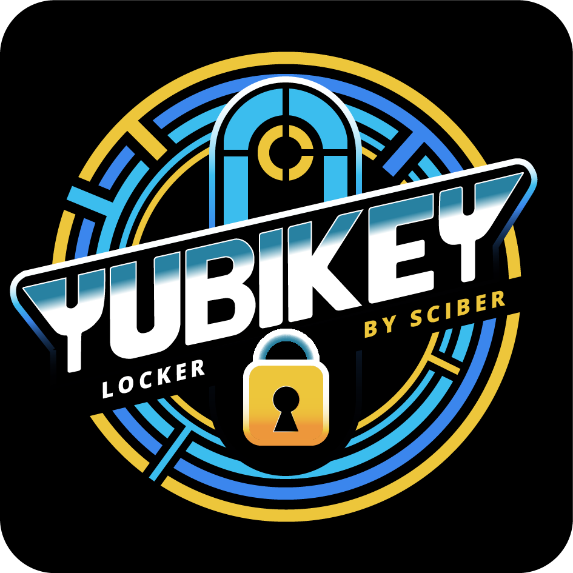

# Sciber YubiKey Locker
[](https://github.com/sciber-io/yklocker/actions/workflows/ci.yml)

For YubiKey users to enable automatic device locking when removing the YubiKey.




### Possible action to take when a YubiKey is not found
| Action        | Windows   | Mac  | Linux  |
| ---           | ---       | ---  | ---    |
| Nothing       | ✅       | ✅   | ✅    |
| Lock Computer | ✅       | ✅   | ✅    |
| Log Out User  | ✅       | ❌   | ✅    |

### Available installation instructions
| Method        | Windows   | Mac   | Linux |
| ---           | ---       | ---  | ---    |
| Intune        | ✅       | ✅   | ❌
| Manual        | ✅       | ✅   | ✅    |


## Installation via Intune
### Windows
1. Download the .admx and .adml files from the "src/windows/Administrative template" folder
2. Intune/GPO: Follow Jonas guide on his blog: https://swjm.blog/locking-the-workstation-on-fido2-security-key-removal-part-2-80962c944c78 to set up GPO/Intune control to decide what you want to do if the YubiKey is removed.
### Mac
- Add an macOS app, upload sciber-yklocker-macos.pkg
- Add the contents of src/macos/post_install_script.sh to the post-install-script box in Intune
- Depending on the groups that the app is pushed to, change contents of the post-install-script to pass apropriate arguments to the application


## Manual Installation
### Windows
1. Download the installer sciber-yklocker.msi from [releases](https://github.com/sciber-io/yklocker/releases)
2. Run the installer (installs the service SciberYklocker for you)
#### Set registry values

1. Download the .admx and .adml files from the "src/windows/Administrative template" folder
2. Locally: download the amdx and adml file to your computer and place them in C:\Windows\PolicyDefinitions, then start local group policy editor -> Computer Configuration -> Administrative Templates -> Sciber Yklocker Settings --> turn on to get registry values

### Mac
- Output is written to syslog, view with Console.app

1. Download sciber-yklocker-macos.pkg from releases and execute it.
2. Download src/macos/post_install_script.sh and execute it
3. Perform a logout or a reboot

### Linux
Download sciber-yklocker-linux and execute it in a terminal (requires you to keep that terminal window open).

- Output is written to syslog.

## Default behavior
sciber-yklocker will check if there is a YubiKey present every 10 seconds. If no command-line arguments / registry values instruments the application to lock the computer it will do nothing.


### Comand line options for Linux/MacOS
```bash
# Run sciber-yklocker
# Defaults to doNothing with the device after 10 seconds without a YubiKey
sciber-yklocker

# Optional arguments:
# Set removalOption
-l Lock|Logout|doNothing

# Set timeout
-t 20

# Example
sciber-yklocker -l Logout -t 30
```


### Credits
Special thanks to [Jonas Markström](https://github.com/JMarkstrom/) for valuable feedback and support during this project.

____
For information regarding how to continue development and build your own binaries see [README-development.md](README-development.md)
